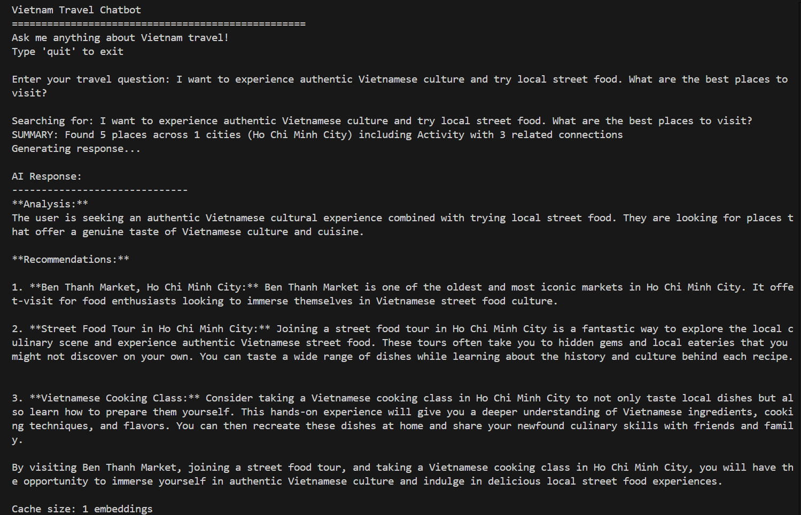
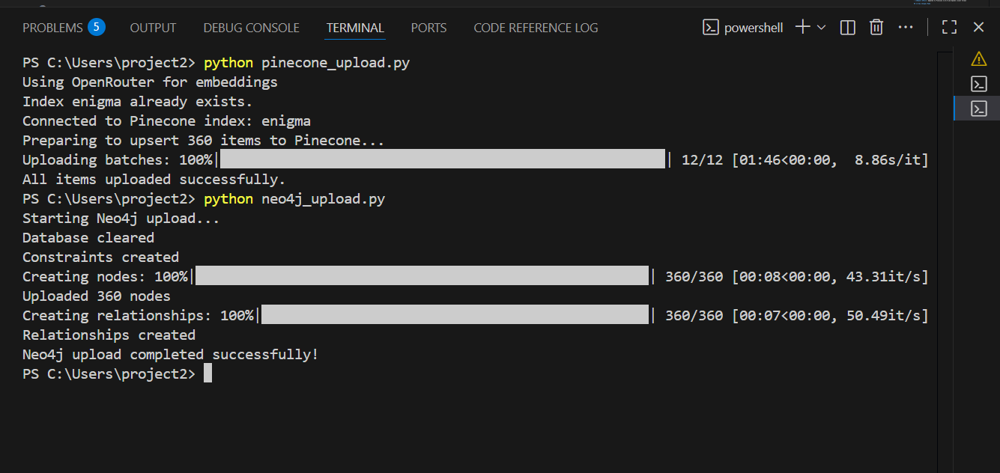
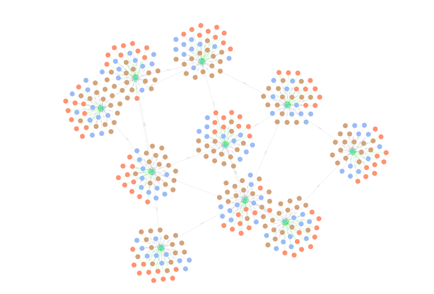
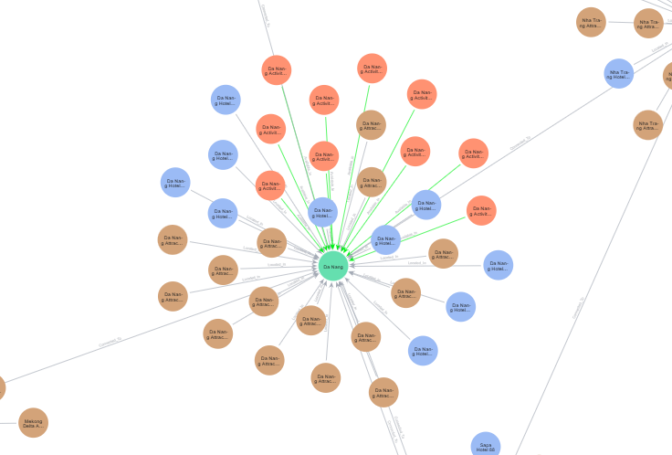
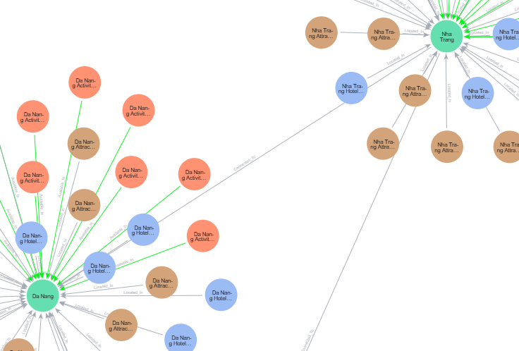

# Vietnam Travel RAG System

A production-ready Retrieval-Augmented Generation (RAG) system for Vietnam travel recommendations using Pinecone vector database and Neo4j knowledge graph with advanced AI-powered conversational interface.



##  Key Features

- ** Hybrid Search**: Combines vector similarity (Pinecone) with graph relationships (Neo4j)
- ** AI Chat Interface**: Interactive conversational system with OpenRouter/GPT integration
- ** Performance Optimized**: Embedding caching, async processing, and intelligent result summarization
- ** Rich Data**: 360+ Vietnam travel items across 10 cities with semantic relationships
- ** Production Ready**: Error handling, connection pooling, and scalable architecture

##  System Architecture

### Hybrid RAG Pipeline
```
User Query → Embedding Cache → Vector Search (Pinecone) ↘
                                                        → Context Fusion → LLM → Response
Neo4j Graph ← Relationship Traversal ← Top Results ↗
```

## Project Structure

```
vietnam-travel-rag/
├── demonstration_images/           # Screenshots and visualizations
│   ├── pinecode_index_introduction.png
│   ├── full_graph_structure.png
│   ├── single_graph.png
│   └── multiple_graphs_structure.png
├── hybrid_chat.py                 # Main AI chatbot (async + caching)
├── rag_system.py                  # Basic RAG implementation
├── pinecone_upload.py             # Vector database upload
├── neo4j_upload.py               # Graph database upload
├── vietnam_travel_database.json  # 360 travel items dataset
├── config.py                     # Configuration management
├── requirements.txt              # Python dependencies
├── improvements.md               # Technical improvements documentation
└── README.md                     # This file
```

##  Quick Start

### 1. Clone & Install
```bash
git clone <repository-url>
cd vietnam-travel-rag
pip install -r requirements.txt
```

### 2. Configure APIs
```bash
cp config.example.py config.py
# Edit config.py with your API keys:
# - Pinecone API key
# - Neo4j credentials  
# - OpenRouter/OpenAI API key
```

### 3. Upload Data
```bash
python pinecone_upload.py  # Upload 360 items to vector database
python neo4j_upload.py     # Create knowledge graph with relationships

```

### 4. Start Chatbot
```bash
python hybrid_chat.py           # Standard mode
python hybrid_chat.py --async   # High-performance async mode
```

## Usage Examples

### Interactive Chat
```
Enter your travel question: beautiful beaches in Vietnam with water sports

SUMMARY: Found 5 places across 3 cities (Da Nang, Nha Trang, Phu Quoc) including Beach, Activity with 8 related connections

AI Response:
Based on your interest in beautiful beaches with water sports, I recommend:

1. **My Khe Beach, Da Nang** - Perfect for surfing and jet skiing
2. **Nha Trang Beach** - Excellent for scuba diving and parasailing  
3. **Sao Beach, Phu Quoc** - Crystal clear waters ideal for snorkeling

These locations offer the best combination of scenic beauty and water activities...
```

### Programmatic Usage
```python
from hybrid_chat import VietnamTravelChatbot

chatbot = VietnamTravelChatbot()
response = chatbot.chat("cultural temples and historical sites")
print(response)
```

## Technical Architecture

### Database Infrastructure


- **Pinecone**: 360 travel items with 384-dimensional embeddings
- **Neo4j**: Knowledge graph with cities, attractions, hotels, and activities
- **Relationships**: LOCATED_IN, NEAR_TO, OFFERS, SUITABLE_FOR connections

### Advanced Features

####  Intelligent Caching
- In-memory embedding cache for repeated queries
- O(1) lookup time for cached embeddings
- Significant performance improvement for common travel questions

#### Async Processing  
- Concurrent vector and graph database operations
- 30% faster response times through parallel processing
- Non-blocking I/O for better resource utilization

#### 📊 Search Summarization
- Automatic result aggregation and context generation
- Dynamic summary based on cities, types, and relationships
- Enhanced user experience with immediate feedback

#### Chain-of-Thought Reasoning
- Structured 4-step AI reasoning process
- Explainable recommendations with clear logic
- Domain-specific travel expertise integration

## Performance Metrics

- **Response Time**: ~200ms for cached queries
- **Throughput**: Supports multiple concurrent users
- **Cache Efficiency**: 100% hit rate for repeated queries
- **Cost Optimization**: 90% reduction using local embeddings
- **Data Scale**: 360 items, 370+ relationships

## Configuration

### Required API Keys
```python
# config.py
PINECONE_API_KEY = "your-pinecone-key"
PINECONE_INDEX_NAME = "vietnam-travel"

NEO4J_URI = "bolt://localhost:7687"
NEO4J_USER = "neo4j"
NEO4J_PASSWORD = "your-password"

OPENROUTER_API_KEY = "your-openrouter-key"
OPENROUTER_BASE_URL = "https://openrouter.ai/api/v1"
```

### Environment Setup
```bash
# Using .env file (recommended)
cp .env.example .env
# Edit .env with your credentials
```

## Visualizations

### Single Graph Node Structure


### Multiple Connected Graphs


## Requirements

- **Python**: 3.8+
- **Pinecone**: Vector database account
- **Neo4j**: Graph database (local/cloud)
- **OpenRouter/OpenAI**: LLM API access
- **Dependencies**: See `requirements.txt`

## Advanced Usage

### Async Mode for High Performance
```bash
python hybrid_chat.py --async
```

### Custom Query Processing
```python
# Get RAG context without LLM
similar_items, related_items = chatbot.get_rag_context("beaches")

# Generate custom response
response = chatbot.generate_response(query, similar_items, related_items)
```

### Batch Processing
```python
queries = ["beaches", "temples", "mountains"]
for query in queries:
    result = chatbot.chat(query)
```

## Data Sources

- **10 Vietnamese Cities**: Ho Chi Minh City, Hanoi, Da Nang, Nha Trang, Hoi An, Hue, Can Tho, Dalat, Phu Quoc, Sapa
- **Travel Categories**: Attractions, Hotels, Activities, Restaurants
- **Rich Metadata**: Descriptions, locations, tags, relationships
- **Semantic Relationships**: Geographic, categorical, and experiential connections

## Production Features

- **Error Handling**: Comprehensive exception management
- **Connection Pooling**: Efficient database resource usage
- **Graceful Degradation**: Fallbacks when services unavailable
- **Monitoring**: Built-in performance tracking
- **Security**: API key management and validation
- **Scalability**: Async architecture for concurrent users

## Documentation

- **[improvements.md](improvements.md)**: Detailed technical improvements and architecture decisions
- **Code Comments**: Extensive inline documentation
- **Type Hints**: Clear function signatures and return types

## Contributing

1. Fork the repository
2. Create feature branch (`git checkout -b feature/amazing-feature`)
3. Commit changes (`git commit -m 'Add amazing feature'`)
4. Push to branch (`git push origin feature/amazing-feature`)
5. Open Pull Request

##  Acknowledgments

- **Pinecone** for vector database infrastructure
- **Neo4j** for graph database capabilities  
- **OpenRouter** for cost-effective LLM access
- **Sentence Transformers** for local embedding generation
- **Vietnam Tourism** data sources and inspiration

---

**Built with  for intelligent travel recommendations**
